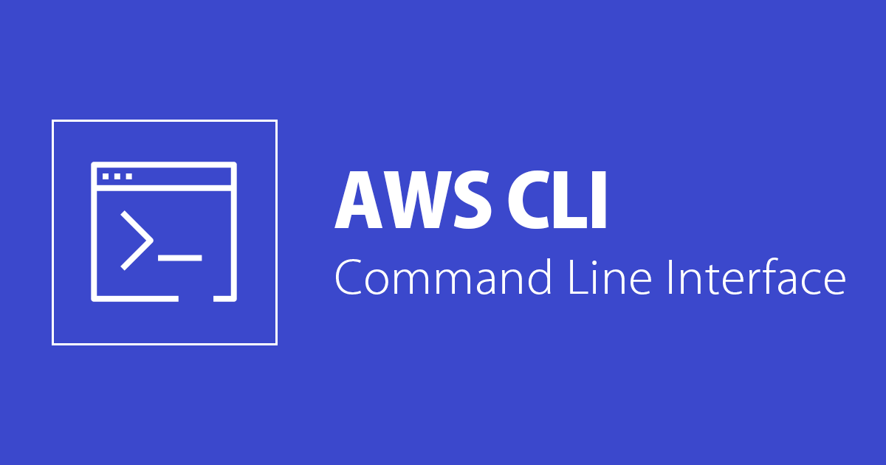

# IAW - Práctica 13.1 AWS CLI (Command Line Interface)

[AWS CLI (Command Line Interface)](https://docs.aws.amazon.com/es_es/cli/index.html) es una herramienta de línea de comandos que permite a los usuarios interactuar con los servicios de AWS desde la terminal de su ordenador. Con [AWS CLI](https://docs.aws.amazon.com/es_es/cli/index.html), los usuarios pueden acceder y administrar una amplia variedad de recursos de AWS, incluidos los servicios de cómputo, almacenamiento, bases de datos, redes, seguridad y mucho más. La AWS CLI es compatible con Windows, Linux y macOS, y se puede instalar fácilmente a través de un gestor de paquetes como pip. Además, se puede utilizar en scripts para automatizar tareas en AWS y en aplicaciones que se ejecutan en AWS.

# 1.2 Instalación de AWS CLI

* Linux
* macOS
* Windows
* Docker

Se recomienda consultar la [documentación oficial](https://docs.aws.amazon.com/es_es/cli/latest/userguide/getting-started-install.html) para obtener los detalles de la instalación para cada una de las opciones disponibles.

## 1.2.1 Instalación en Linux
Para realizar la instalación de AWS CLI en un sistema operativo Linux sobre una arquitectura x86 de 64 bits, tenemos que ejcutar los siguientes comandos.

__Paso 1.__ Descargamos un archivo .zip con la aplicación AWS CLI.

    curl "https://awscli.amazonaws.com/awscli-exe-linux-x86_64.zip" -o "awscliv2.zip"

__Paso 2.__ Descomprimimos el archivo que acabamos de descargar.

    unzip awscliv2.zip

__Paso 3.__ Ejectuamos el script de instalación.

    sudo ./aws/install

__Paso 4.__ Comprobamos que la instalación se ha realizado de forma correcta.

    aws --version
## 1.2.2 Instalación en macOS
* [Instalación de AWS CLI desde la interfaz de usuario.](https://docs.aws.amazon.com/es_es/cli/latest/userguide/getting-started-install.html#cliv2-mac-install-cmd)
* [Instalación de AWS CLI desde la línea de comandos.](https://docs.aws.amazon.com/es_es/cli/latest/userguide/getting-started-install.html#cliv2-mac-install-cmd)
## 1.2.3 Instalación en Windows
* [Instalación de AWS CLI desde la interfaz de usuario.](https://docs.aws.amazon.com/es_es/cli/latest/userguide/getting-started-install.html#cliv2-mac-install-cmd)

# 1.3 Configuración de AWS CLI
## 1.3.1 Opción 1. Con el comando ```aws configure```
Para configurar AWS CLI ejecutaremos el siguiente comando.
    
    aws configure

Este comando preguntará por los siguientes datos:

    AWS Access Key ID [None]: 
    AWS Secret Access Key [None]: 
    Default region name [None]: 
    Default output format [None]: 

Con los que creará un archivo de texto llamado `credentials` dentro del directorio home del usuario.
* En Linux se encuentra en la ruta `~/.aws/credentials`.
* En Windows estará en la ruta: `C:\Users\usuario\.aws\credentials`.
## 1.3.1 Opción 2. Copiando el contenido del archivo `credentials` de AWS Academy.
Si queremos utilizar las credenciales de __AWS Academy__ solo tenemos que copiar en el archivo ~/.aws/credentials los datos que nos aparecen en el apartado __AWS Details__ -> __Cloud Access__ -> __AWS CLI__, dentro del __Learner Lab__ de AWS Academy.

__Ejemplo de un archivo `credentials`__.

    [default]
    aws_access_key_id=BSICYBW38QHVAVV7P365
    aws_secret_access_key=DE/CB2FGCx8EV34x0EtuZfJg39E7hapZ9suhXBzF
    aws_session_token=FwoGZXIvYXdzECkaDAGFN5okYCHateFXISK9AYwT4gghzz5hIr6TZs9X8pQaOYPZvTCNSrLtJoaw/fEwz9...XBzH

Para __configurar la región de AWS a utilizar__ y el __formato de salida__ se puede ejecutar el comando `aws configure` de nuevo o abrir el archivo `config` dentro del directorio `.aws` y agregar los siguientes datos:

* Región: `us-east-1`
* Formato de salida: `json`

__Ejemplo de un archivo `config`__.

    [default]
    region = us-east-1
    output = json

# 1.4 Ejercicios
## Estructura
```txt
├── Ejercicio01
│   ├── scripts
│   │   └── create_sg.sh
│   └── variables
│       └── vars.sh
├── Ejercicio02
│   ├── scripts
│   │   └── run_instance.sh
│   └── variables
│       └── vars.sh
├── Ejercicio03
│   ├── scripts
│   │   ├── eliminar_practica9.sh
│   │   └── montar_practica9.sh
│   └── variables
│       └── vars.sh
├── Ejercicio04
│   ├── scripts
│   │   ├── 00-terminate_all_instances.sh
│   │   ├── 01-delete_all_security_groups.sh
│   │   ├── 02-delete_all_elastic_ips.sh
│   │   ├── 03-create_security_groups.sh
│   │   ├── 04-create_instances.sh
│   │   ├── 05-create_elastic_ip.sh
│   │   └── user-data.sh
│   └── variables
│       └── vars.sh
├── Ejercicio05
│   └── scripts
│       └── mostrar_info.sh
├── img
│   └── logo.png
└── README.md
```
## 1.4.1 Ejercicio 1
* Crea un grupo de seguridad para las máquinas del Backend con el nombre backend-sg.
* Añada las siguientes reglas al grupo de seguridad:
    - Acceso SSH (puerto 22/TCP) desde cualquier dirección IP.
    - Acceso al puerto 3306/TCP desde cualquier dirección IP.

Solución:

```bash
#!/bin/bash
set -x
# ----------------------------------------------------------------------
# Variables de Configuración
# ----------------------------------------------------------------------
source "$(dirname "${BASH_SOURCE[0]}")/../variables/vars.sh"


# Deshabilitamos la paginación de la salida de los comandos de AWS CLI
# Referencia: https://docs.aws.amazon.com/es_es/cli/latest/userguide/cliv2-migration.html#cliv2-migration-output-pager
export AWS_PAGER=""

# Creamos el grupo de seguridad: backend-sg
aws ec2 create-security-group \
    --group-name $GROUP_NAME \
    --description "Grupo de Seguridad $GROUP_NAME para maquinas Backend"

# Creamos una regla de accesso SSH desde cualquier IP
aws ec2 authorize-security-group-ingress \
    --group-name $GROUP_NAME \
    --protocol $PROTOCOL_01 \
    --port $PORT_01 \
    --cidr $NETWORK_01

# Creamos una regla de accesso para el puerto 3306 desde cualquier IP
aws ec2 authorize-security-group-ingress \
    --group-name $GROUP_NAME \
    --protocol $PROTOCOL_01 \
    --port $PORT_02 \
    --cidr $NETWORK_01
```


## 1.4.2 Ejercicio 2
* Crea una instancia EC2 para la máquina del Backend con las siguientes características.

    * Identificador de la AMI: ami-08e637cea2f053dfa. Esta AMI se corresponde con la imagen Red Hat Enterprise Linux 9 (HVM).
    * Número de instancias: 1
    * Tipo de instancia: t2.micro
    * Clave privada: vockey
    * Grupo de seguridad: * backend-sg
    * Nombre de la instancia: backend

Solución:
```bash
#!/bin/bash
set -x
# ----------------------------------------------------------------------
# Variables de Configuración
# ----------------------------------------------------------------------
source "$(dirname "${BASH_SOURCE[0]}")/../variables/vars.sh"

# Deshabilitamos la paginación de la salida de los comandos de AWS CLI
# Referencia: https://docs.aws.amazon.com/es_es/cli/latest/userguide/cliv2-migration.html#cliv2-migration-output-pager
export AWS_PAGER=""

# Creamos una intancia EC2 con el Identificador AMI correspondiente a Red Hat Enterprise Linux 9.
aws ec2 run-instances \
    --image-id $AMI_ID \
    --instance-type $INSTANCE_TYPE \
    --key-name $KEY_NAME \
    --security-group-ids $SECURITY_GROUP_BACKEND \
    --count $COUNT \
    --tag-specifications "ResourceType=instance,Tags=[{Key=Name,Value=$INSTANCE_NAME_BACKEND}]"
```

## 1.4.3 Ejercicio 3

* Crear un script para crear la infraestructura de la práctica 9.
* Crear un script para eliminar la infraestructura de la práctica 9.

Solución para montar la infraestructura:
```bash
#!/bin/bash
set -x
# ----------------------------------------------------------------------
# Variables de Configuración
# ----------------------------------------------------------------------
source "$(dirname "${BASH_SOURCE[0]}")/../variables/vars.sh"

# Deshabilitamos la paginación de la salida de los comandos de AWS CLI
# Referencia: https://docs.aws.amazon.com/es_es/cli/latest/userguide/cliv2-migration.html#cliv2-migration-output-pager
export AWS_PAGER=""

##################################################################################################################################

# Creamos el grupo de seguridad: FrontEndSecurityGroup
aws ec2 create-security-group \
    --group-name $FRONTEND_GROUP_NAME \
    --description "Grupo de Seguridad $FRONTEND_GROUP_NAME para maquinas FrontEnd."

# Creamos una regla de accesso SSH desde cualquier IP
aws ec2 authorize-security-group-ingress \
    --group-name $FRONTEND_GROUP_NAME \
    --protocol $PROTOCOL_01 \
    --port $PORT_01_FRONTEND \
    --cidr $NETWORK_01

# Creamos una regla de accesso para el puerto HTTP
aws ec2 authorize-security-group-ingress \
    --group-name $FRONTEND_GROUP_NAME \
    --protocol $PROTOCOL_01 \
    --port $PORT_02_FRONTEND \
    --cidr $NETWORK_01

##################################################################################################################################

# Creamos el grupo de seguridad: BackEndSecurityGroup
aws ec2 create-security-group \
    --group-name $BACKEND_GROUP_NAME \
    --description "Grupo de Seguridad $BACKEND_GROUP_NAME para maquinas BackEnd."

# Creamos una regla de accesso SSH desde cualquier IP
aws ec2 authorize-security-group-ingress \
    --group-name $BACKEND_GROUP_NAME \
    --protocol $PROTOCOL_01 \
    --port $PORT_01_BACKEND \
    --cidr $NETWORK_01

# Creamos una regla de accesso para el puerto 3306 desde cualquier IP
aws ec2 authorize-security-group-ingress \
    --group-name $BACKEND_GROUP_NAME \
    --protocol $PROTOCOL_01 \
    --port $PORT_02_BACKEND \
    --cidr $NETWORK_01
##################################################################################################################################

# Creamos el grupo de seguridad: NFS
aws ec2 create-security-group \
    --group-name $NFS_GROUP_NAME \
    --description "Grupo de Seguridad $NFS_GROUP_NAME para maquinas servidor NFS."

# Creamos una regla de accesso SSH
aws ec2 authorize-security-group-ingress \
    --group-name $NFS_GROUP_NAME \
    --protocol $PROTOCOL_01 \
    --port $PORT_01_NFS \
    --cidr $NETWORK_01

# Creamos una regla de accesso para MySQL
aws ec2 authorize-security-group-ingress \
    --group-name $NFS_GROUP_NAME \
    --protocol $PROTOCOL_01 \
    --port $PORT_02_NFS \
    --cidr $NETWORK_01

##################################################################################################################################

# Creamos el grupo de seguridad: BALANCEADOR
aws ec2 create-security-group \
    --group-name $LOADBALANCER_GROUP_NAME \
    --description "Grupo de Seguridad $LOADBALANCER_GROUP_NAME para maquinas Balanceador de carga."

# Creamos una regla de accesso SSH
aws ec2 authorize-security-group-ingress \
    --group-name $LOADBALANCER_GROUP_NAME \
    --protocol $PROTOCOL_01 \
    --port $PORT_01_LOAD_BALANCER \
    --cidr $NETWORK_01

# Creamos una regla de accesso HTTP
aws ec2 authorize-security-group-ingress \
    --group-name $LOADBALANCER_GROUP_NAME \
    --protocol $PROTOCOL_01 \
    --port $PORT_02_LOAD_BALANCER \
    --cidr $NETWORK_01

# Creamos una regla de accesso HTTPS
aws ec2 authorize-security-group-ingress \
    --group-name $LOADBALANCER_GROUP_NAME \
    --protocol $PROTOCOL_01 \
    --port $PORT_03_LOAD_BALANCER \
    --cidr $NETWORK_01

######################################                      Instancias                      ##########################################################

# Creamos una intancia EC2 Balanceador de carga.
aws ec2 run-instances \
    --image-id $AMI_ID \
    --instance-type $INSTANCE_TYPE02 \
    --key-name $KEY_NAME \
    --security-group-ids $LOADBALANCER_GROUP_NAME \
    --count $COUNT \
    --tag-specifications "ResourceType=instance,Tags=[{Key=Name,Value=$INSTANCE_NAME_LOADBALANCER}]"

##################################################################################################################################

# Creamos una intancia EC2 FrontEnd01.
aws ec2 run-instances \
    --image-id $AMI_ID \
    --instance-type $INSTANCE_TYPE01 \
    --key-name $KEY_NAME \
    --security-group-ids $FRONTEND_GROUP_NAME \
    --count $COUNT \
    --tag-specifications "ResourceType=instance,Tags=[{Key=Name,Value=$INSTANCE_NAME_FRONTEND01}]"

##################################################################################################################################

# Creamos una intancia EC2 FrontEnd02.
aws ec2 run-instances \
    --image-id $AMI_ID \
    --instance-type $INSTANCE_TYPE01 \
    --key-name $KEY_NAME \
    --security-group-ids $FRONTEND_GROUP_NAME \
    --count $COUNT \
    --tag-specifications "ResourceType=instance,Tags=[{Key=Name,Value=$INSTANCE_NAME_FRONTEND02}]"

##################################################################################################################################

# Creamos una intancia EC2 BackEnd.
aws ec2 run-instances \
    --image-id $AMI_ID \
    --instance-type $INSTANCE_TYPE02 \
    --key-name $KEY_NAME \
    --security-group-ids $BACKEND_GROUP_NAME \
    --count $COUNT \
    --tag-specifications "ResourceType=instance,Tags=[{Key=Name,Value=$INSTANCE_NAME_BACKEND}]"

##################################################################################################################################

# Creamos una intancia EC2 Servidor NFS.
aws ec2 run-instances \
    --image-id $AMI_ID \
    --instance-type $INSTANCE_TYPE02 \
    --key-name $KEY_NAME \
    --security-group-ids $NFS_GROUP_NAME \
    --count $COUNT \
    --tag-specifications "ResourceType=instance,Tags=[{Key=Name,Value=$INSTANCE_NAME_NFS}]"

##################################################################################################################################

sleep 15
 
# Obtenemos el Id de la instancia a partir de su nombre
INSTANCE_ID=$(aws ec2 describe-instances \
            --filters "Name=tag:Name,Values=$INSTANCE_NAME_LOADBALANCER" \
                      "Name=instance-state-name,Values=running" \
            --query "Reservations[*].Instances[*].InstanceId" \
            --output text)

# Creamos una IP elástica
ELASTIC_IP=$(aws ec2 allocate-address --query PublicIp --output text)

# Asociamos la IP elástica a la instancia del balanceador
aws ec2 associate-address --instance-id $INSTANCE_ID --public-ip $ELASTIC_IP
```
Solución para eliminar la infraestructura:
```bash
#!/bin/bash
set -x
# ----------------------------------------------------------------------
# Variables de Configuración
# ----------------------------------------------------------------------
source "$(dirname "${BASH_SOURCE[0]}")/../variables/vars.sh"

# Deshabilitamos la paginación de la salida de los comandos de AWS CLI
# Referencia: https://docs.aws.amazon.com/es_es/cli/latest/userguide/cliv2-migration.html#cliv2-migration-output-pager
export AWS_PAGER=""

# Eliminar instancias en ejecución con los siguientes nombres
names=("$INSTANCE_NAME_FRONTEND01" "$INSTANCE_NAME_FRONTEND02" "$INSTANCE_NAME_BACKEND" "$INSTANCE_NAME_NFS" "$INSTANCE_NAME_LOADBALANCER")

for name in "${names[@]}"; do
    instance_id=$(aws ec2 describe-instances \
        --filters "Name=tag:Name,Values=$name" "Name=instance-state-name,Values=running" \
        --query 'Reservations[*].Instances[*].[InstanceId]' --output text)

    if [ -z "$instance_id" ]; then
        echo "No se encontraron instancias en ejecución con el nombre $name"
        continue
    fi

    # Obtiene el ID de la IP elástica asociada a la instancia
    EIP_ID=$(aws ec2 describe-addresses --filters "Name=instance-id,Values=$instance_id" --query "Addresses[].AllocationId" --output text)
    # Elimina la IP elástica
    aws ec2 release-address --allocation-id $EIP_ID

    echo "Eliminando instancia en ejecución con el nombre $name y ID $instance_id..."
    aws ec2 terminate-instances --instance-ids $instance_id

done

# Esperar 25 segundos
echo "Esperando 25 segundos..."
sleep 25

# Eliminar grupos de seguridad
security_groups=($FRONTEND_GROUP_NAME $BACKEND_GROUP_NAME $NFS_GROUP_NAME $LOADBALANCER_GROUP_NAME)

for security_group in "${security_groups[@]}"; do
    group_id=$(aws ec2 describe-security-groups \
        --filters "Name=group-name,Values=$security_group" \
        --query 'SecurityGroups[*].[GroupId]' --output text)

    if [ -z "$group_id" ]; then
        echo "No se encontró ningún grupo de seguridad con el nombre $security_group"
        continue
    fi

    echo "Eliminando grupo de seguridad con el nombre $security_group y ID $group_id..."
    aws ec2 delete-security-group --group-id $group_id
done
```

## 1.4.4 Ejercicio 4
Modifique los scripts del repositorio de ejemplo:

* https://github.com/josejuansanchez/practica-aws-cli

para que utilicen la siguiente AMI.

* Nombre de la AMI: Ubuntu Server 22.04 LTS (HVM).
* Identificador de la AMI: ami-06878d265978313ca.

También tendrá que modificar los scripts para que se ejecute el siguiente comando en las instancias durante el inicio.

    $ sudo apt update && sudo apt upgrade -y

Solución:

Añadir la siguiente línea a los scripts del repositorio de ejemplo:

    --user-data file://user-data.sh

Donde `user-data.sh` es un archivo de script para shell con el siguiente código:

```bash
#!/bin/bash
set -x
# Actualización de repositorios.
apt update && sudo apt upgrade -y
```
## 1.4.5 Ejercicio 5
Escriba un script de bash que muestre el nombre de todas instancias EC2 que tiene en ejecución junto a su dirección IP pública.

Solución:
```bash
#!/bin/bash

# Obtener las IDs de todas las instancias EC2 en ejecución
instance_ids=$(aws ec2 describe-instances --filters "Name=instance-state-name,Values=running" --query "Reservations[*].Instances[*].InstanceId" --output text)

# Para cada ID de instancia, obtener su nombre y dirección IP pública
for instance_id in $instance_ids
do
  name=$(aws ec2 describe-tags --filters "Name=resource-id,Values=$instance_id" "Name=key,Values=Name" --query "Tags[0].Value" --output text)
  public_ip=$(aws ec2 describe-instances --instance-ids $instance_id --query "Reservations[0].Instances[0].PublicIpAddress" --output text)

  # Imprimir el nombre y la dirección IP pública de la instancia
  echo "$name: $public_ip"
done
```

