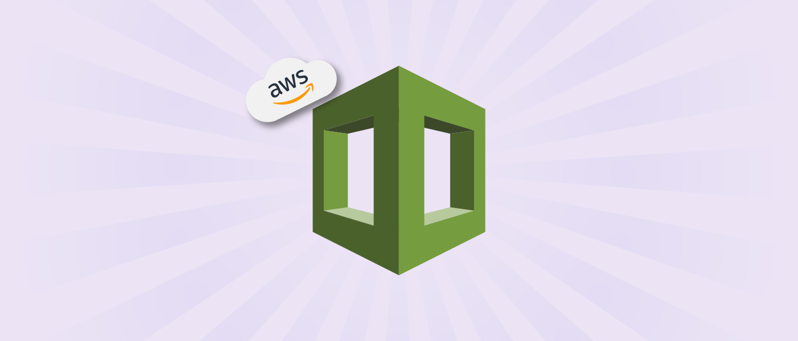

# IAW - Práctica 13.2 AWS CloudFormation


[AWS CloudFormation](https://docs.aws.amazon.com/es_es/AWSCloudFormation/latest/UserGuide/Welcome.html) es un servicio que permite modelar y configurar recursos de AWS con el fin de automatizar la creación y gestión de recusos en AWS a partir de una plantilla.


# 1 Ventajas e Inconvenientes
Algunas de las ventajas que nos ofrece este servicio son:

* Permite automatizar la creación de recursos, reduciendo así posibles errores en el proceso de creación de forma manual.
* Permite reutilizar plantillas para otros proyectos y configuraciones.
* Garantizamos que todos los entornos que creamos con las plantillas son idénticos.
* Permite tener una documentación de los recursos que creamos.
* Podemos utilizar un control de versiones para controlar los cambios que se realizan en las plantillas.

Algunos de los inconvenientes que podemos encontrar son:

* Es un servicio exclusivo de AWS, por lo que no podemos utilizarlo para crear recursos en otros proveedores de servicios en la nube.
* No están disponibles todos los servicios de AWS.
* Aunque AWS nos proporciona la herramienta [AWS CloudFormation Designer](https://console.aws.amazon.com/cloudformation/designer/home) para crear las plantillas, a veces puede ser un poco complicado describir la infraestructura que necesitamos.

# 1.2 Gestión de stacks desde la línea de comandos con AWS CLI
## 1.2.1 Crear un stack
La plantilla o template es un archivo JSON o YAML que describe los recursos y configuraciones que queremos crear en AWS.

Un stack o una pila, es una colección de recursos de infraestructura que se crean a partir de una plantilla.

Para crear una pila de AWS CloudFormation desde la línea de comandos con AWS podemos ejecutar el siguiente comando:

    aws cloudformation create-stack \
        --stack-name <nombre_del_stack> \
        --template-body file://<path-de-la_plantilla>

Donde `<nombre_del_stack>` es el nombre que queremos darle a la pila y `<path-de-la_plantilla>` es la ruta del archivo que contiene la plantilla.

__NOTA:__ Las dobles barras ``//`` son absolutamente necesarias.

Si la plantilla contiene parámetros, podemos especificarlos en la línea de comandos con el parámetro `--parameters`:

    aws cloudformation create-stack \
    --stack-name ejemplo-05 \
    --template-body file://ejemplo-05/ec2.yaml \
    --parameters ParameterKey=KeyName,ParameterValue=vockey \
                ParameterKey=InstanceType,ParameterValue=t2.small \
                ParameterKey=ImageId,ParameterValue=ami-08e637cea2f053dfa

## 1.2.2 Listado de stacks
Para obtener un listado **información básica** de los stacks, como el nombre, el estado actual y la fecha de creación, se utiliza el comando:

    aws cloudformation list-stacks

Para obtener un listado con **información más detallada**, se utiliza el comando:

    aws cloudformation describe-stacks

También es posible consultar información de un stack específico con el comando:

    aws cloudformation describe-stacks --stack-name <nombre_stack>

## 1.2.3 Eliminar un stack
Para eliminar un stack y todos los recursos asociados, se utiliza el comando:

    aws cloudformation delete-stack --stack-name <nombre_stack>

# 1.3 Ejercicios
## 1.3.1 Ejercicio 1
Escriba una plantilla de [AWS CloudFormation](https://docs.aws.amazon.com/cloudformation/index.html) que cree la infraestructura necesaria para desplegar la aplicación web propuesta en la [práctica 7](https://github.com/aben086/iaw-practica-07).

Solución:
```yaml
AWSTemplateFormatVersion: "2010-09-09"
Description: |
  Esta plantilla crea la infraestructura necesaria para la implantación de una aplicación Web
  Lamp en dos niveles (práctica 7), formada por una capa de front-end con un servidor web Apache HTTP Server
  y una capa de back-end con un servidor MySQL.

Resources:
  # Creación de la instancia FrontEnd
  FrontEndSecurityGroup:
    Type: AWS::EC2::SecurityGroup
    Properties:
      GroupDescription: Grupo de seguridad de la capa frontend.
      SecurityGroupIngress:
        - IpProtocol: tcp
          FromPort: 22
          ToPort: 22
          CidrIp: 0.0.0.0/0
        - IpProtocol: tcp
          FromPort: 80
          ToPort: 80
          CidrIp: 0.0.0.0/0
        - IpProtocol: tcp
          FromPort: 443
          ToPort: 443
          CidrIp: 0.0.0.0/0
  FrontEndInstance:
    Type: AWS::EC2::Instance
    Properties:
      ImageId: ami-06878d265978313ca
      InstanceType: t2.small
      SecurityGroups:
        - !Ref FrontEndSecurityGroup
      KeyName: vockey
      Tags:
        - Key: Name
          Value: FrontEnd
  MyEIP:
    Type: AWS::EC2::EIP
  MyEIPAssociation:
    Type: AWS::EC2::EIPAssociation
    DependsOn: MyEIP
    Properties:
      AllocationId: !GetAtt MyEIP.AllocationId
      InstanceId: !Ref FrontEndInstance
  # Creación de la instancia BackEnd
  BackEndSecurityGroup:
    Type: AWS::EC2::SecurityGroup
    Properties:
      GroupDescription: Grupo de seguridad de la capa backend.
      SecurityGroupIngress:
        - IpProtocol: tcp
          FromPort: 22
          ToPort: 22
          CidrIp: 0.0.0.0/0
        - IpProtocol: tcp
          FromPort: 3306
          ToPort: 3306
          CidrIp: 0.0.0.0/0
  BackEndInstance:
    Type: AWS::EC2::Instance
    Properties:
      ImageId: ami-06878d265978313ca
      InstanceType: t2.small
      SecurityGroups:
        - !Ref BackEndSecurityGroup
      KeyName: vockey
      Tags:
        - Key: Name
          Value: BackEnd
```

## 1.3.2 Ejercicio 2
Escriba una plantilla de [AWS CloudFormation](https://docs.aws.amazon.com/cloudformation/index.html) que cree la infraestructura necesaria para desplegar la aplicación web propuesta en la [práctica 9](https://github.com/aben086/iaw-practica-09).

Solución:
```yaml
AWSTemplateFormatVersion: "2010-09-09"
Description: |
  Esta plantilla crea la infraestructura necesaria para la implantación de una aplicación Web
  Lamp en dos niveles (práctica 7), formada por una capa de front-end con un servidor web Apache HTTP Server
  y una capa de back-end con un servidor MySQL.

Resources:
  # Creación de la instancia balanceador de carga
  BalancerSecurityGroup:
    Type: AWS::EC2::SecurityGroup
    Properties:
      GroupDescription: Grupo de seguridad del balanceador de carga.
      SecurityGroupIngress:
        - IpProtocol: tcp
          FromPort: 22
          ToPort: 22
          CidrIp: 0.0.0.0/0
        - IpProtocol: tcp
          FromPort: 80
          ToPort: 80
          CidrIp: 0.0.0.0/0
        - IpProtocol: tcp
          FromPort: 443
          ToPort: 443
          CidrIp: 0.0.0.0/0
  BalancerInstance:
    Type: AWS::EC2::Instance
    Properties:
      ImageId: ami-06878d265978313ca
      InstanceType: t2.medium
      SecurityGroups:
        - !Ref BalancerSecurityGroup
      KeyName: vockey
      Tags:
        - Key: Name
          Value: Balancer
  MyEIP:
    Type: AWS::EC2::EIP
  MyEIPAssociation:
    Type: AWS::EC2::EIPAssociation
    DependsOn: MyEIP
    Properties:
      AllocationId: !GetAtt MyEIP.AllocationId
      InstanceId: !Ref BalancerInstance

  # Creación de la instancia FrontEnd-01
  FrontEndSecurityGroup:
    Type: AWS::EC2::SecurityGroup
    Properties:
      GroupDescription: Grupo de seguridad de la instancia FrontEnd-01.
      SecurityGroupIngress:
        - IpProtocol: tcp
          FromPort: 22
          ToPort: 22
          CidrIp: 0.0.0.0/0
        - IpProtocol: tcp
          FromPort: 80
          ToPort: 80
          CidrIp: 0.0.0.0/0
        - IpProtocol: tcp
          FromPort: 443
          ToPort: 443
          CidrIp: 0.0.0.0/0
  FrontEnd01Instance:
    Type: AWS::EC2::Instance
    Properties:
      ImageId: ami-06878d265978313ca
      InstanceType: t2.small
      SecurityGroups:
        - !Ref FrontEndSecurityGroup
      KeyName: vockey
      Tags:
        - Key: Name
          Value: FrontEnd-01

  # Creación de la instancia FrontEnd-02
  FrontEnd02Instance:
    Type: AWS::EC2::Instance
    Properties:
      ImageId: ami-06878d265978313ca
      InstanceType: t2.small
      SecurityGroups:
        - !Ref FrontEndSecurityGroup
      KeyName: vockey
      Tags:
        - Key: Name
          Value: FrontEnd-02

  # Creación de la instancia Servidor NFS
  NFSServerSecurityGroup:
    Type: AWS::EC2::SecurityGroup
    Properties:
      GroupDescription: Grupo de seguridad del servidor NFS.
      SecurityGroupIngress:
        - IpProtocol: tcp
          FromPort: 22
          ToPort: 22
          CidrIp: 0.0.0.0/0
        - IpProtocol: tcp
          FromPort: 2048
          ToPort: 2048
          CidrIp: 0.0.0.0/0
  NFSServerInstance:
    Type: AWS::EC2::Instance
    Properties:
      ImageId: ami-06878d265978313ca
      InstanceType: t2.small
      SecurityGroups:
        - !Ref NFSServerSecurityGroup
      KeyName: vockey
      Tags:
        - Key: Name
          Value: NFS-Server

  # Creación de la instancia BackEnd
  BackEndSecurityGroup:
    Type: AWS::EC2::SecurityGroup
    Properties:
      GroupDescription: Grupo de seguridad de la capa backend.
      SecurityGroupIngress:
        - IpProtocol: tcp
          FromPort: 22
          ToPort: 22
          CidrIp: 0.0.0.0/0
        - IpProtocol: tcp
          FromPort: 3306
          ToPort: 3306
          CidrIp: 0.0.0.0/0
  BackEndInstance:
    Type: AWS::EC2::Instance
    Properties:
      ImageId: ami-06878d265978313ca
      InstanceType: t2.small
      SecurityGroups:
        - !Ref BackEndSecurityGroup
      KeyName: vockey
      Tags:
        - Key: Name
          Value: BackEnd
```


