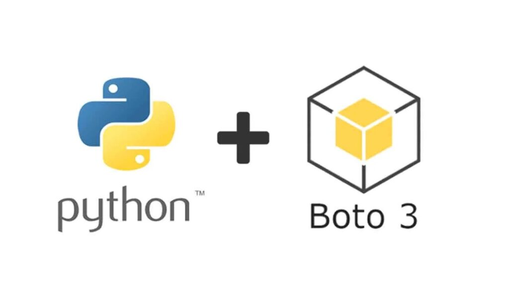

# IAW - Práctica 13.3 AWS SDK para Python (Boto3)

# ¿Qué es Boto3?
[Boto3](https://aws.amazon.com/es/sdk-for-python/) es un SDK (Software Development Kit) de [Python](https://www.python.org/) desarrollado por y para Amazon Web Services (AWS). Este SDK permite a los desarrolladores interactuar con los servicios de AWS para crear y gestionar recursos como grupos de seguridad o instancias EC2, a través de aplicaciones escritas en [Python](https://www.python.org/).
# Ejercicios
En esta práctica se realizó la creación de las infraestructuras necesarias para cumplir con la descripción de los ejercicios dados.
Para ello se utilizarán las funcionalidades de aws-python-boto3
## Estructura
```txt
.
├── common
│   ├── aws_resource_class.py
│   ├── aws_resource_functions.py
│   └── __init__.py
├── README.md
└── scripts
    ├── Ejercicio01.py
    ├── Ejercicio02.py
    ├── Ejercicio03_montar.py
    ├── Ejercicio03_tirar.py
    ├── Ejercicio04.py
    ├── __pycache__
    │   ├── vars2.cpython-310.pyc
    │   ├── vars3.cpython-310.pyc
    │   └── vars.cpython-310.pyc
    ├── vars2.py
    ├── vars3.py
    └── vars.py
```
## Ejercicio 1
Escriba un script de Python para crear un grupo de seguridad con el nombre `backend-sg`. Añada las siguientes reglas al grupo de seguridad:

* Acceso SSH (puerto 22/TCP) desde cualquier dirección IP.
* Acceso al puerto 3306/TCP desde cualquier dirección IP.

Solución:
```python
from common import aws_resource_functions as aws

import vars as vars

# Security group ingress permissions
ingress_permissions = [
    {'CidrIp': '0.0.0.0/0', 'IpProtocol': 'tcp', 'FromPort': vars.ssh_port, 'ToPort': vars.ssh_port},
    {'CidrIp': '0.0.0.0/0', 'IpProtocol': 'tcp', 'FromPort': vars.mysql_port, 'ToPort': vars.mysql_port}]


# Es posible usar las siguientes sentencias en vez de utilizar variables.
# Read security group name and description
#sg_name = input('Security group name: ')
#sg_description = input('Security group description: ')

# Creamos el grupo de seguridad
aws.create_security_group(vars.group_name, vars.group_description, ingress_permissions)

# Se listarán en pantalla los grupos de seguridad
aws.list_security_groups()
```
## Ejercicio 2
Escriba un script de Python para crear una instancia EC2 que tengas las siguientes características.

* Identificador de la AMI: ami-08e637cea2f053dfa. Esta AMI se corresponde con la imagen Red Hat Enterprise Linux 9 (HVM).
* Número de instancias: 1
* Tipo de instancia: t2.micro
* Clave privada: vockey
* Grupo de seguridad: backend-sg
* Nombre de la instancia: backend

Solución:
```python
from common import aws_resource_functions as aws

import vars2 as vars


# Check if security group exists
if aws.security_group_exists(vars.sg_name) == False:
    print('The security group does not exist')
    exit()

# Create the instance
aws.create_instance(vars.ami, vars.count, vars.instance_type, vars.key_name, vars.instance_name, vars.sg_name)

# List instances
aws.list_instances()
```

## Ejercicio 3
* Crea un script para crear la infraestructura de la práctica 9.

Solución:
```python
from common import aws_resource_functions as aws

import vars3 as vars

# Grupo de seguridad para máquinas BackEnd
backend_ingress_permissions = [
    {'CidrIp': '0.0.0.0/0', 'IpProtocol': 'tcp', 'FromPort': vars.ssh_port, 'ToPort': vars.ssh_port},        
    {'CidrIp': '0.0.0.0/0', 'IpProtocol': 'tcp', 'FromPort': vars.mysql_port, 'ToPort': vars.mysql_port}]

# Grupo de seguridad para máquinas frontend
frontend_ingress_permissions = [
    {'CidrIp': '0.0.0.0/0', 'IpProtocol': 'tcp', 'FromPort': vars.ssh_port, 'ToPort': vars.ssh_port},        
    {'CidrIp': '0.0.0.0/0', 'IpProtocol': 'tcp', 'FromPort': vars.mysql_port, 'ToPort': vars.mysql_port},
    {'CidrIp': '0.0.0.0/0', 'IpProtocol': 'tcp', 'FromPort': vars.https_port, 'ToPort': vars.https_port}]

# Grupo de seguridad para el balanceador de carga
balancer_ingress_permissions = [
    {'CidrIp': '0.0.0.0/0', 'IpProtocol': 'tcp', 'FromPort': vars.ssh_port, 'ToPort': vars.ssh_port},        
    {'CidrIp': '0.0.0.0/0', 'IpProtocol': 'tcp', 'FromPort': vars.http_port, 'ToPort': vars.http_port},
    {'CidrIp': '0.0.0.0/0', 'IpProtocol': 'tcp', 'FromPort': vars.https_port, 'ToPort': vars.https_port}]

# Grupo de seguridad para el servidor NFS
nfs_ingress_permissions = [
    {'CidrIp': '0.0.0.0/0', 'IpProtocol': 'tcp', 'FromPort': vars.ssh_port, 'ToPort': vars.ssh_port},        
    {'CidrIp': '0.0.0.0/0', 'IpProtocol': 'tcp', 'FromPort': vars.nfs_port, 'ToPort': vars.nfs_port}]


permissions = {
    'BackEndSecurityGroup': backend_ingress_permissions,
    'FrontEndSecurityGroup': frontend_ingress_permissions,
    'LoadBalancerSecurityGroup': balancer_ingress_permissions,
    'NFSServerSecurityGroup': nfs_ingress_permissions
}

for group_name in [vars.backend_sg, vars.frontend_sg,vars.loadbalancer_sg,vars.nfs_sg]:
    group_description = vars.security_groups[group_name]
    ingress_permissions= permissions[group_name]

    if aws.security_group_exists(group_name):
        print(f"El grupo de seguridad {group_name} ya existe.")
    else:
        aws.create_security_group(group_name, group_description, ingress_permissions)
        print(f"El grupo de seguridad {group_name} ha sido creado.")


# Creamos las instancias
aws.create_instance(vars.ami, vars.count, vars.instance_type_med, vars.key_name, vars.instance_name_lb, vars.loadbalancer_sg)
aws.create_instance(vars.ami, vars.count, vars.instance_type_sma, vars.key_name, vars.instance_name_frontend01, vars.frontend_sg)
aws.create_instance(vars.ami, vars.count, vars.instance_type_sma, vars.key_name, vars.instance_name_frontend02, vars.frontend_sg)
aws.create_instance(vars.ami, vars.count, vars.instance_type_med, vars.key_name, vars.instance_name_backend, vars.backend_sg)
aws.create_instance(vars.ami, vars.count, vars.instance_type_sma, vars.key_name, vars.instance_name_nfs, vars.nfs_sg)

# Get Elastic IP from instance ID
load_balancer_id = aws.get_instance_id(vars.instance_name_lb)

# Alocar IP Elástica
elastic_ip = aws.allocate_elastic_ip()
# Asociar Ip Elástica
aws.associate_elastic_ip(elastic_ip, load_balancer_id)

# Listado de instancias
aws.list_instances()
```
* Crea un script para eliminar la infraestructura de la práctica 9.

Solución:
```python
from common import aws_resource_functions as aws

import vars3 as vars
import time

# Lista de nombres de los grupos de seguridad y de las instancias que queremos eliminar
group_names = [vars.backend_sg, vars.frontend_sg, vars.loadbalancer_sg, vars.nfs_sg]
instance_names = [vars.instance_name_backend, vars.instance_name_frontend01, 
                  vars.instance_name_frontend02, vars.instance_name_lb, 
                  vars.instance_name_nfs]

# Obtenemos el ID del balanceador de carga
load_balancer_id = aws.get_instance_id(vars.instance_name_lb)

# Se comproba su existencia
if load_balancer_id == None:
    print('No hay ninguna instancia con ese nombre.')
    exit()
#else:
    # Obtener IP elástica de ID de instancia
    #elastic_ip = aws.get_instance_public_ip(load_balancer_id)

    # Release Elastic IP
    #aws.release_elastic_ip(elastic_ip)

for instance in instance_names:
    print(f'Terminando la instancia {instance}...')
    aws.terminate_instance(instance)

print('Esperando 30 segundos para resolver posibles errores de dependencia.')
time.sleep(30)

for sg in group_names:
    print(f'Eliminando grupo de seguridad {sg}...')
    aws.delete_security_group(sg)

```
## Ejercicio 4
Modifique los ejemplos 7 y 14 de [este repositorio](https://github.com/josejuansanchez/aws-python-boto3) que utilizan `boto3.resource`, para añadir una nuevas funcionalidades. Por ejemplo, a la hora de crear una nueva instancia EC2 el programa puede mostrar al usuario una lista de AMIs disponibles y una lista de tipos de instancia.

Solución:

```python
from common import aws_resource_functions as aws

import os
import time

def show_menu():
    print('\n-- Security Group --')
    print(' 1. Create security group')
    print(' 2. Delete security group')
    print(' 3. List security groups')
    print('-- EC2 Instance --')
    print(' 4. Create EC2 instance')
    print(' 5. Start EC2 instance')
    print(' 6. Stop EC2 instance')
    print(' 7. Terminate EC2 instance')
    print('-- EC2 Instances --')    
    print(' 8. List all EC2 instances')
    print(' 9. Start all EC2 instances')
    print(' 10. Stop all EC2 instances')
    print(' 11. Terminate all EC2 instances')
    print('-- Elastic IP --')
    print(' 12. Allocate and associate Elastic IP')
    print(' 13. Release Elastic IP')
    print(' 14. Exit')

def show_instance_types():
    print('--- Available instance types ---')
    print('1. t2.micro')
    print('2. t2.small')
    print('3. t2.medium')
    print('4. t2.large')

def show_ami_list():
    print('--- Available AMI images ---')
    print('1. Ubuntu Server 22.04 LTS')
    print('2. Amazon Linux 2')
    print('3. Windows Server 2022 Base')
    print('4. Red Hat Enterprise Linux 9')

    .
    .
    .
    .

    option = 0
    while option != 14:
        os.system('cls' if os.name == 'nt' else 'clear')
        show_menu()
        option = int(input('\nSelect an option (1-14): '))

        if option == 1:
            sg_name = input('Security group name: ')
            sg_description = input('Security group description: ')
            aws.create_security_group(sg_name, sg_description, ingress_permissions)
        elif option == 2:
            sg_name = input('Security group name: ')
            aws.delete_security_group(sg_name)
        elif option == 3:
            aws.list_security_groups()
        elif option == 4:
            os.system('cls' if os.name == 'nt' else 'clear')
            show_ami_list()
            ami_option = int(input('Selecciona una AMI (1-4): '))
            if ami_option == 1:
                ami = 'ami-0557a15b87f6559cf' # Ubuntu Server 22.04 LTS
            elif ami_option == 2:
                ami = 'ami-0dfcb1ef8550277af' # Amazon Linux 2
            elif ami_option == 3:
                ami = 'ami-0c2b0d3fb02824d92' # Windows Server 2022 Base
            elif ami_option == 4:
                ami = 'ami-0c9978668f8d55984' # Red Hat Enterprise Linux 9
            else:
                print('Opción no válida')
                time.sleep(5)

            show_instance_types()
            ami_type = int(input('Selecciona una AMI (1-4): '))
            if ami_type == 1:
                instance_type = 't2.micro'
            elif ami_type == 2:
                instance_type = 't2.small'
            elif ami_type == 3:
                instance_type = 't2.medium'
            elif ami_type == 4:
                instance_type = 't2.large'
            else:
                print('Opción no válida')
                time.sleep(5)

            # Read the input parameters
            instance_name = input('Instance name: ')
            min_count = int(input('Min count: '))
            sg_name = input('Security group: ')

            # Check if security group exists
            if not aws.security_group_exists(sg_name):
                print('The security group does not exist')
                time.sleep(5)
                continue

            # Create the instance
            aws.create_instance(ami, min_count, instance_type, key_name, instance_name, sg_name)
            time.sleep(5)
```
